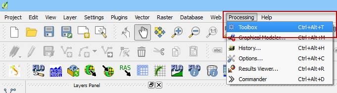
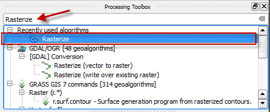
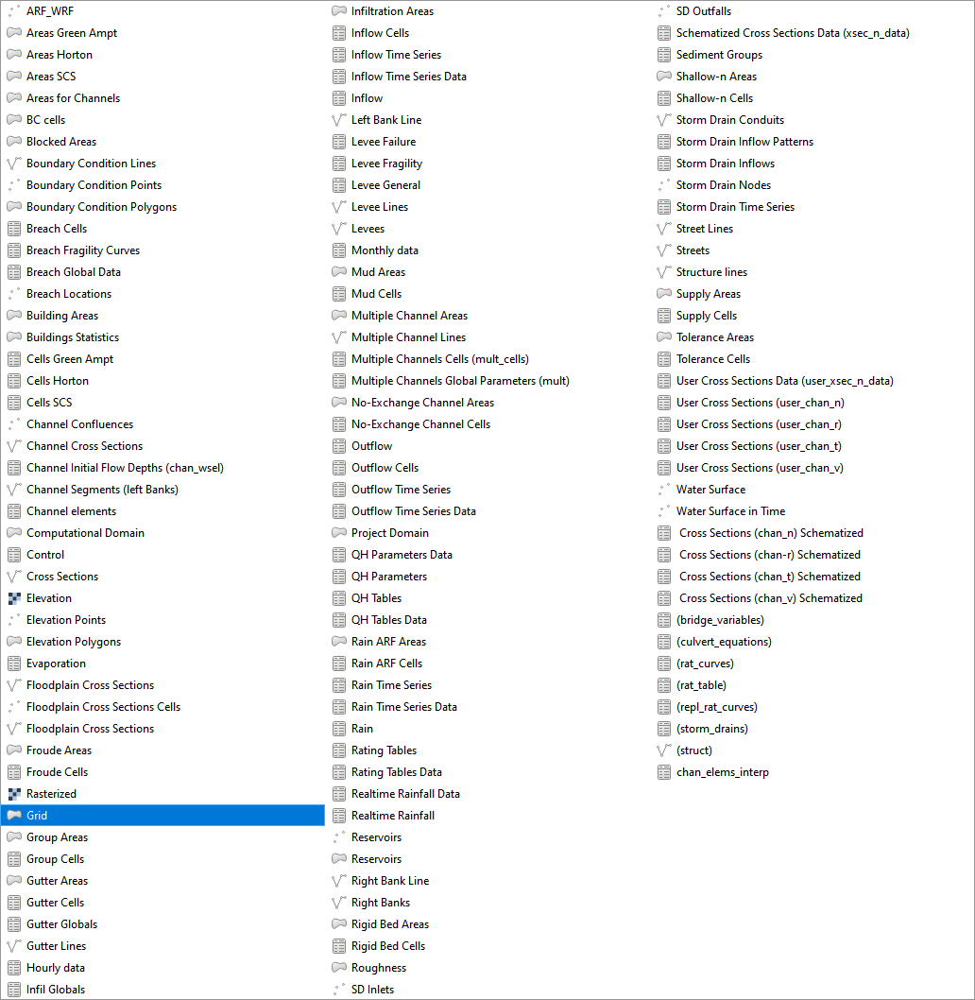
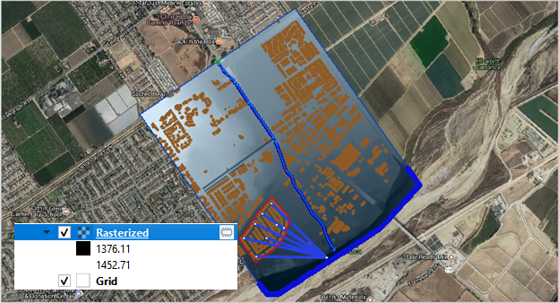
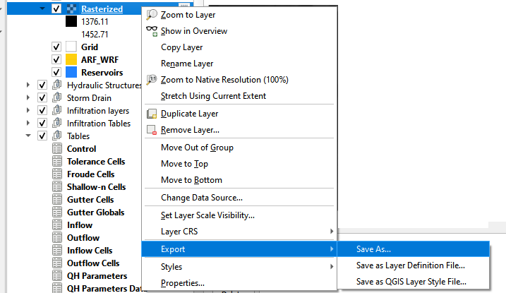

Create a raster
===============

Overview
--------

There are many uses for rasterized data in QGIS. It loads faster and is
easier to style. FLO-2D spatial data and results can quickly be
rasterized with this process.

Rasterize Grid Layer
--------------------

1. In this example, the grid elevation raster is used. To create a grid
   elevation raster, use the Saga-Rasterize tool.

2. On the Main QGIS Menu, click *Processing*>\ *Toolbox*.

3. Enter the search term *Rasterize* in the Processing Toolbox search
   feature. Double click the *Saga Rasterized tool*.

4. Change the dialog box as shown below and click *Run*.

5. Cell size is the grid element size.

6. Fit = cells will ensure that the raster pixels are centered on the
   grid elements.

7. Saga-Rasterize is a good raster generator for FLO-2D data because it
   builds a raster with hidden null data.

8. If you want a temporary layer, leave the Rasterized field emptly.

9. If you want a permanent file, use the Rasterize/Browser button to
   place the file in a directory. In this example a temporary file is
   used.

.. image:: img/createaraster3.png
   :width: 5.8326in
   :height: 8.06149in

10. Shapes = Grid Layer

11. Attribute = elevation or whatever attribute you want to rasterize.

12. Method for Multiple is default unless you want something in a
    different resolution from the source data.

13. Method for lines = 0. Processing won’t run without this value. It
    isn’t important.

14. Method for lines = 0. Processing won’t run without this value. It
    isn’t important.

15. Target = float

16. Output extent is important. Choose the Grid Layer

..

   .. image:: img/createaraster4.png
      :width: 1.91643in
      :height: 0.71866in

1. Fit = cells

2. Rasterized = Temporary or browse to a file locaiton.

Save the Permanent layer
------------------------

17. In this example, the raster that is created is a temporary layer
    called *Rasterize*.

18. This layer can be saved to a permanent layer using the QGIS *Save
    As* feature. T

19. To save a temporary layer, right click the layer and click
    Export/Save As.

20. Navigate to the location and save the file.

21. Fill out the Save File data and click OK Most of the data is default
    for this type of processing.

..

   .. image:: img/createaraster8.png
      :width: 6.00967in
      :height: 6.68666in
