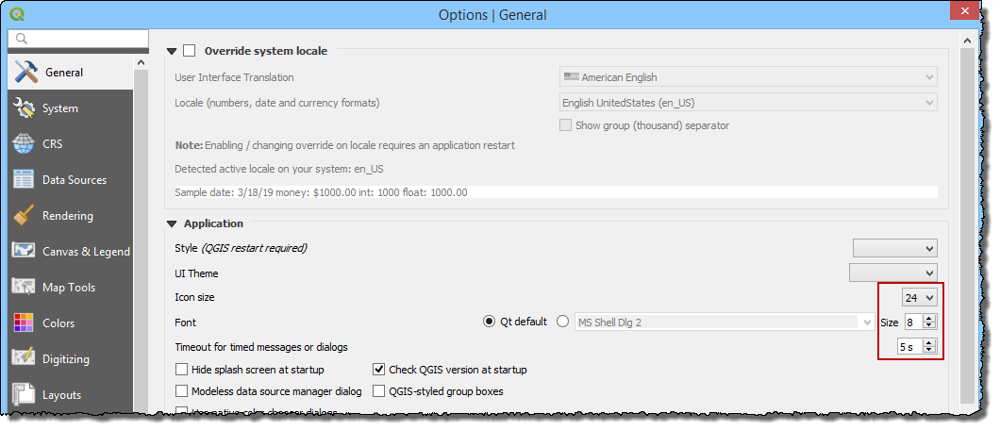

High Definition Screens
=======================

If the computer has a high definition resolution or ultra-high
definition resolution, QT creator and QGIS may need an adjustment so all
windows can be loaded correctly.

For QT Creator Windows
----------------------

If the data in Widgets and Dialog Boxes is squeezed or not readable, set
the *Environmental Variables* for QT Creator scaling factor, on the
*Advanced* tab of the *System Properties* window, following the figures
shown below. Set the *Environmental Variables* for the System not the
user.

.. figure:: img/highdefscreen1.png
	:align: left
	:alt: Creating a new model database

For QGIS, navigate to *Settings > Options > General* and set the icon
size to 24 and the text size to 8. Try a few different combinations to
suit the current screen.

