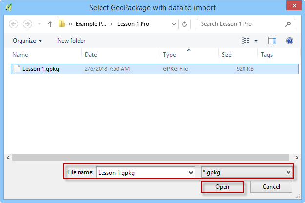

Import a GeoPackage from a Previous Build
=========================================

When the FLO-2D Plugin is updated, the GeoPackage structure changes. The
project can no longer be opened in the standard method described in the
previous section.

To update a GeoPackage:
-----------------------

1. Set up a new project (see FLO-2D Plugin Settings).

1. Select the Import from GeoPackage icon from the FLO-2D Toolbar.

   .. image:: img/importgpkg1.png

2. Navigate to the location of the GeoPackage and click Open.

