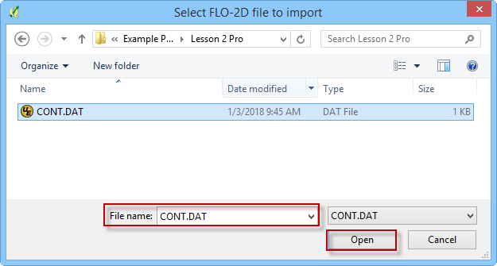
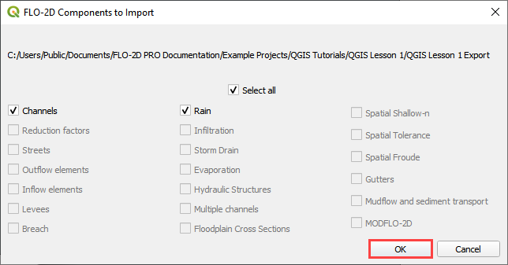

Import the FLO-2D \*.DAT files into the Project
===============================================

To import a FLO-2D data files into a Geopackage:

1. Click the Import GDS Files

   .. image:: img/importdatafiles1.png

1. Navigate to the FLO-2D \*.DAT files

2. Select CONT.DAT and click Open.

3. Select the desired components and click OK

4. The message bar will tell state the files were imported.

5. The dialog box will show the files that were imported.

.. image:: img/importdatafiles4.png

